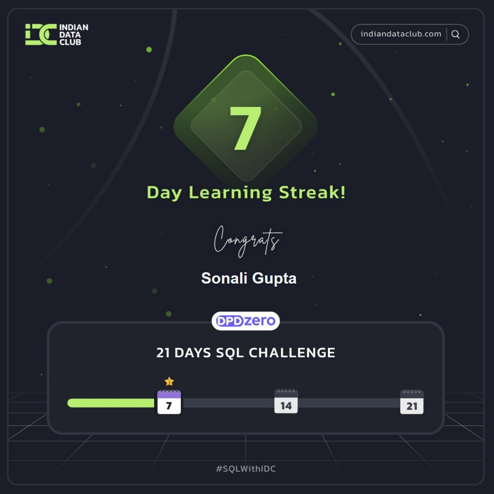
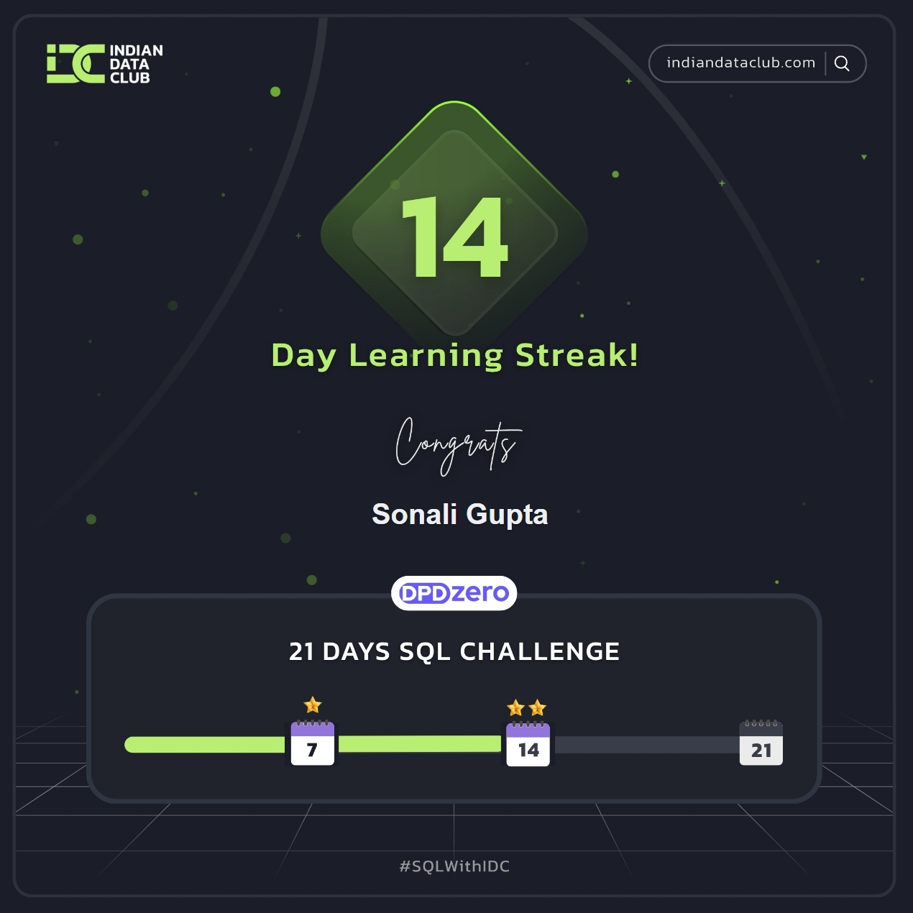
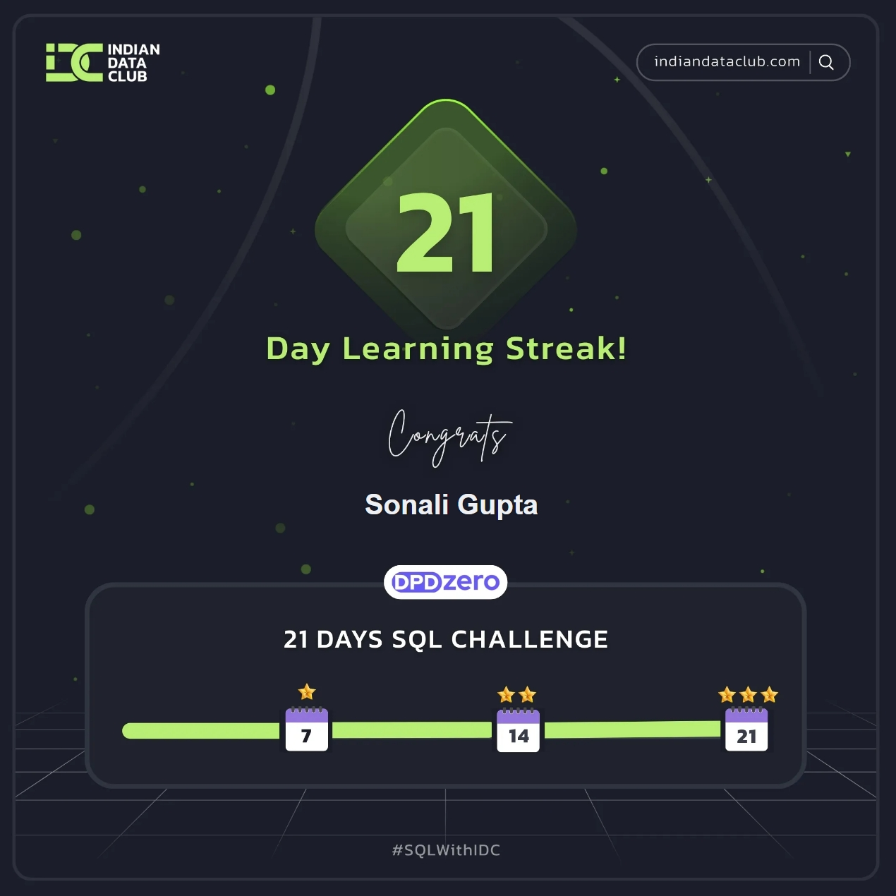

## 🧠 21-Days-SQL-Challenge
Welcome to my submission repository for the 21 Days SQL Challenge hosted by Indian Data Club! 🎯

This challenge is designed to build and strengthen SQL skills from beginner to advanced through daily problem-solving, datasets, and real-world scenarios.

  
  
  

### 🚀 About the Challenge
The 21 Days SQL Challenge focuses on hands-on learning - from SQL fundamentals to advanced analytical queries.

### 📅 Challenge Overview

- **Duration:** 21 Days

- **Focus Areas:** SQL Basics → Joins → Subqueries → CTEs → Window Functions → Query Optimization → Data Modeling → Analytics

- **Objective:** Strengthen SQL proficiency for roles in Data Analysis, Data Engineering, Data Science, and Software Development.

### 📘 My Learning Plan
I’ll be uploading my daily SQL challenges, queries, and solutions in this repository.

**Each folder will contain:**

  - 📂 **`Day_X/`** — Challenge topic, problem statements, and SQL queries

  - 📝 Insights & learnings from each day’s practice

### 🧾 Dataset Details
The primary dataset for this challenge is the Hospital Beds Management dataset.

**Source:** Kaggle – [Hospital Beds Management](https://www.kaggle.com/datasets/jaderz/hospital-beds-management)

### 🚀 Let's Connect!
Feel free to follow my progress, fork the repo, and share your own journey.  
Connect with me on [LinkedIn](https://www.linkedin.com/in/sonaligupta13/) or check out my blog for insights!
